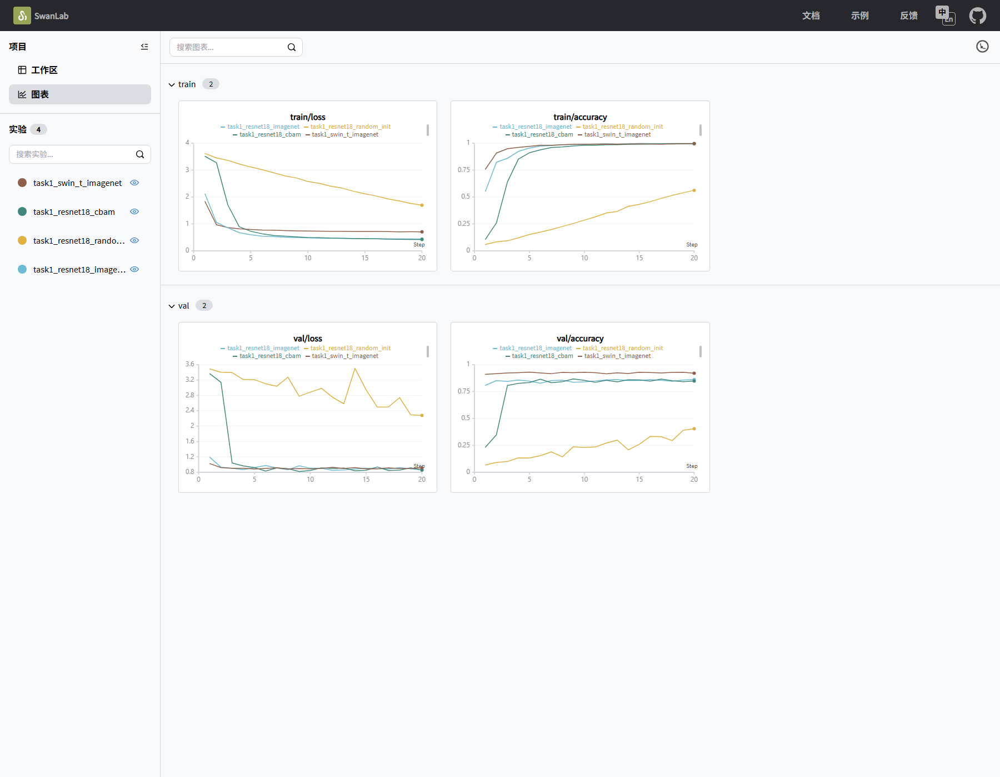
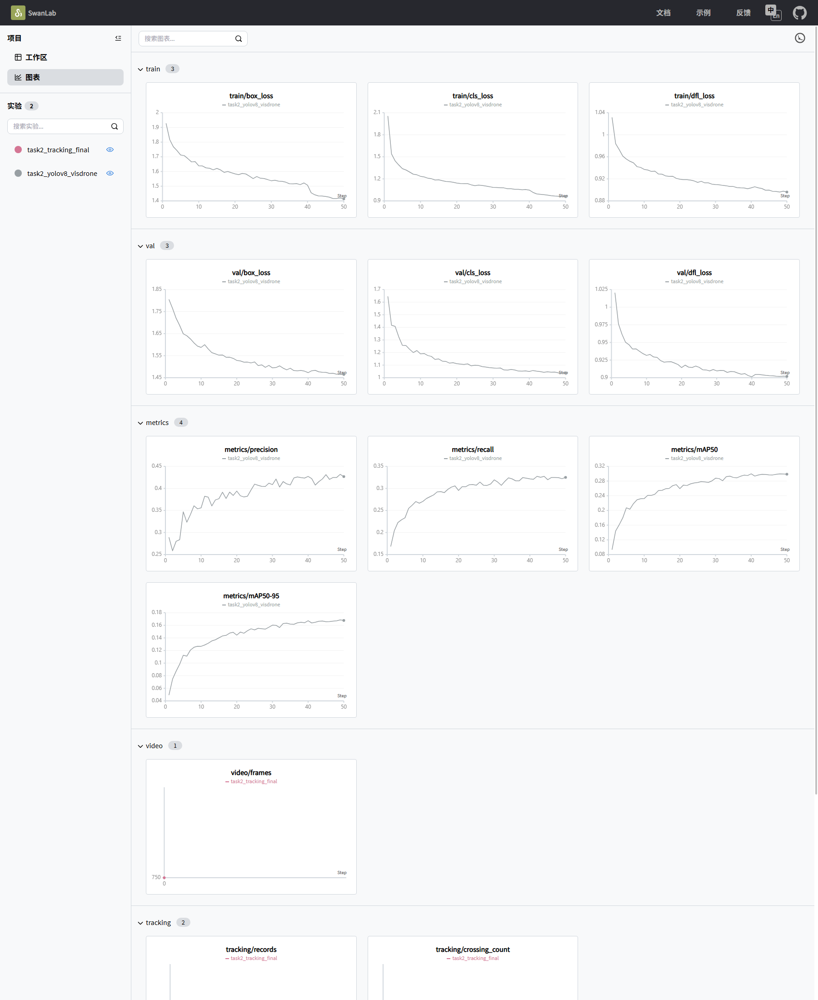
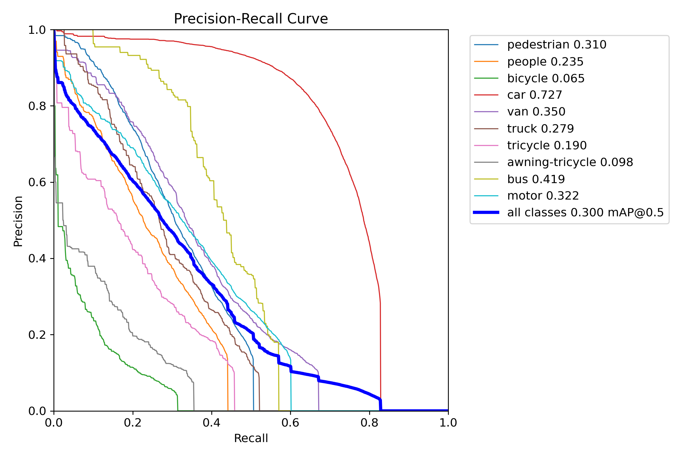
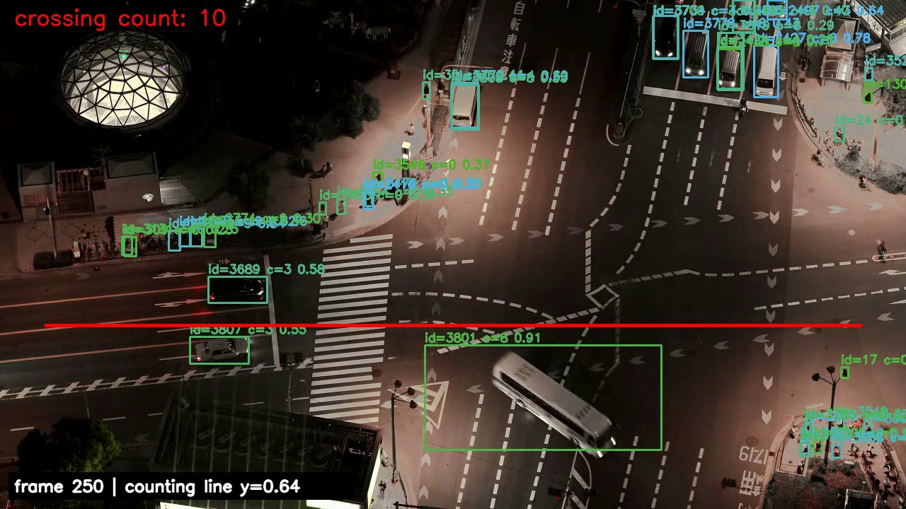
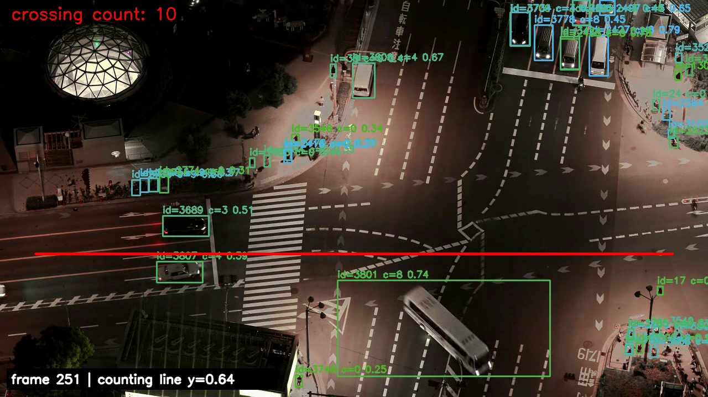
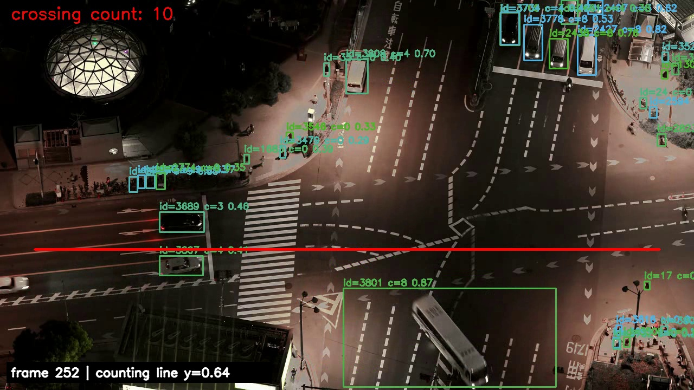
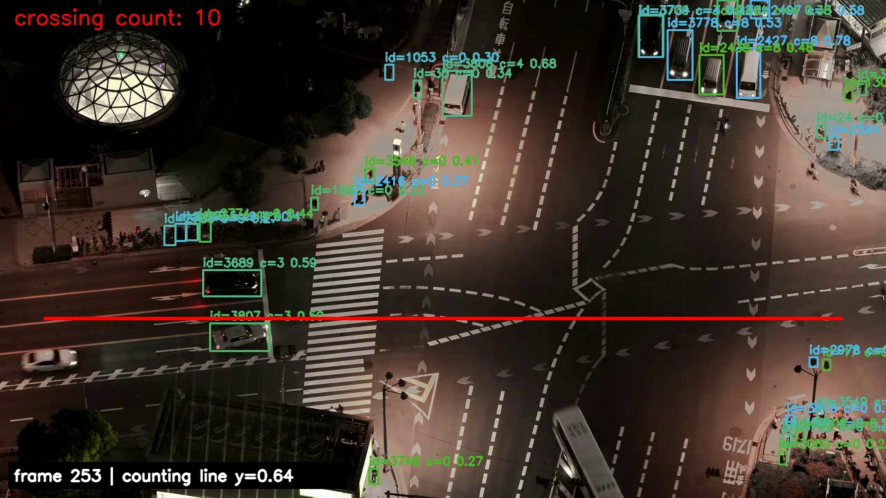
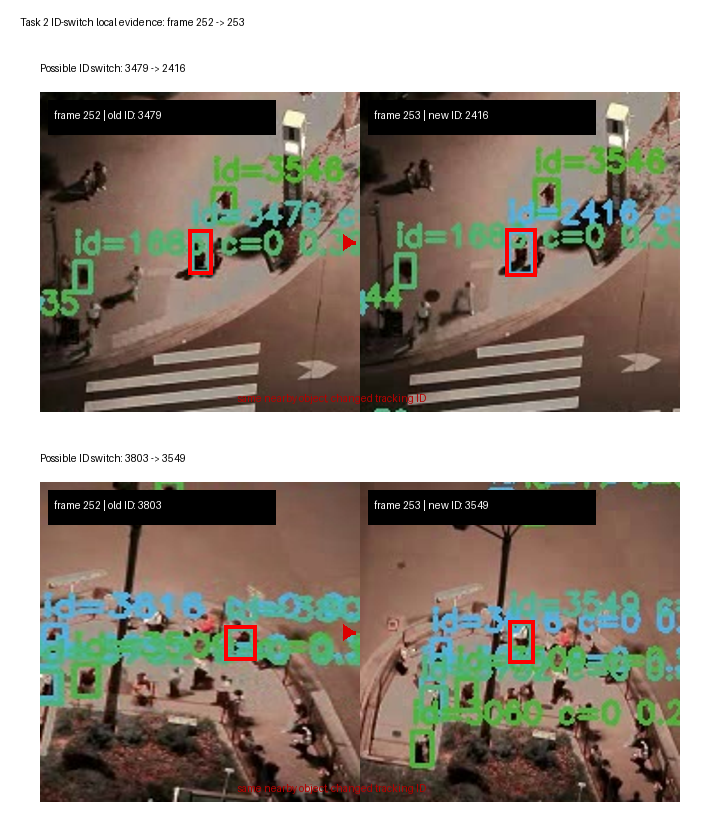
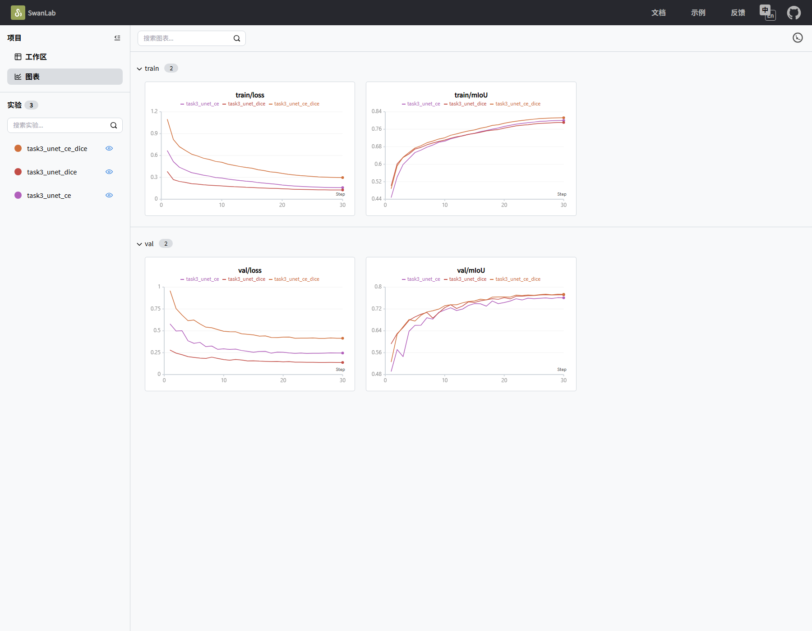
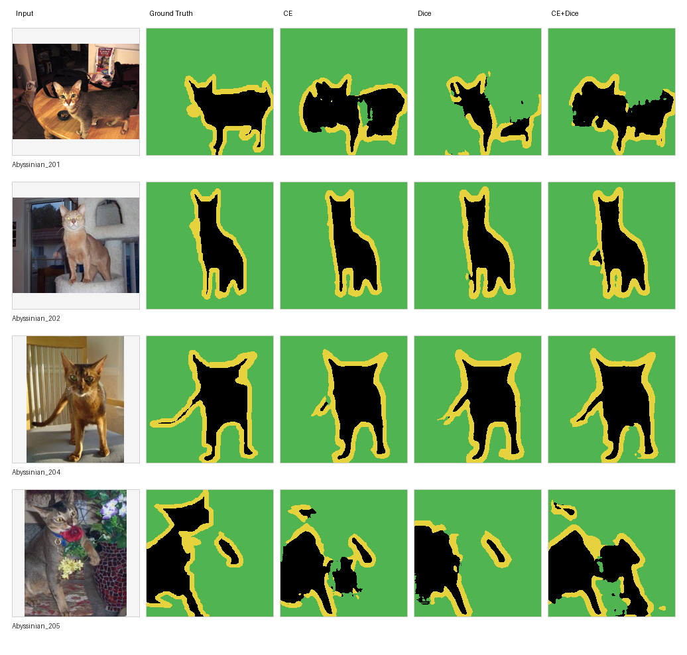

# 计算机视觉 HW2 实验报告

## 小组信息

- 成员:潘越
- 学号:23307140058
- Github repo：<https://github.com/yvepan/CV-hw2-panyue>
- 模型权重网盘地址：<https://drive.google.com/file/d/19YITjP_QeCgeC1rVTKM4qRmJJ8zOlmK4/view?usp=drive_link>
- 权重说明：GitHub 仓库不包含模型权重；网盘压缩包中包含任务 1、任务 2 和任务 3 的全部 `best.pt` 权重。
- 权重压缩包内容：
  - 任务 1：`resnet18_imagenet_best.pt`、`resnet18_random_init_best.pt`、`resnet18_cbam_best.pt`、`swin_t_imagenet_best.pt`
  - 任务 2：`yolov8n_visdrone_best.pt`
  - 任务 3：`unet_ce_best.pt`、`unet_dice_best.pt`、`unet_ce_dice_best.pt`

## 任务 1：微调 ImageNet 预训练 CNN 实现宠物识别

### 1.1 任务目标

- 数据集：Oxford-IIIT Pet Dataset。
- 类别数：37 类宠物。
- 目标：比较 ImageNet 预训练、随机初始化、注意力模块和 Transformer backbone 对分类准确率的影响。
- 评价指标：验证集 Accuracy。

### 1.2 数据与训练设置

- 官方 `trainval`：3680 张，用作训练集。
- 官方 `test`：3669 张，用作验证/测试集。
- 输入尺寸：224x224。
- 标准化：ImageNet mean/std。
- 数据增强：
  - `RandomResizedCrop`
  - `RandomHorizontalFlip`
  - `ColorJitter`
- 训练硬件：NVIDIA GeForce RTX 3080 Ti Laptop GPU。

### 1.3 模型与超参数

| 实验 | 初始化 | 模型 | 注意力 | 参数量 | batch size | learning rate | epoch | loss |
| --- | --- | --- | --- | ---: | ---: | --- | ---: | --- |
| baseline | ImageNet | ResNet-18 | none | 11.20M | 32 | head 1e-3 / base 1e-4 | 20 | CE + label smoothing |
| random-init | 随机 | ResNet-18 | none | 11.20M | 32 | 1e-3 | 20 | CE + label smoothing |
| cbam | ImageNet | ResNet-18 | CBAM | 11.28M | 32 | head 1e-3 / base 1e-4 | 20 | CE + label smoothing |
| swin-t | ImageNet | Swin-T | none | 27.55M | 16 | head 5e-4 / base 5e-5 | 20 | CE + label smoothing |

补充设置：

- baseline 将 ResNet-18 最后一层全连接层替换为 37 类输出。
- baseline 和 CBAM 实验前 2 个 epoch 冻结 backbone，之后整体微调。
- 优化器：AdamW。
- weight decay：`1e-4`。
- 学习率调度：CosineAnnealingLR。

### 1.4 实验结果

| 实验 | best epoch | val accuracy |
| --- | ---: | ---: |
| ResNet-18 ImageNet baseline | 13 | 0.8610 |
| ResNet-18 random init | 20 | 0.4050 |
| ResNet-18 + CBAM | 9 | 0.8673 |
| Swin-T ImageNet | 5 | 0.9302 |



### 1.5 结果分析

- **预训练收益明显**：ResNet-18 从随机初始化的 0.4050 提升到 0.8610，说明在 Oxford-IIIT Pet 这种中等规模细粒度分类任务上，ImageNet 预训练特征比从零学习更稳定。
- **CBAM 有轻微提升**：ResNet-18 + CBAM 达到 0.8673，比 baseline 高 0.0063，参数量只增加约 0.08M。由于本实验没有做多随机种子重复，0.63 个百分点的提升不应被解释为严格显著优势，更合理的结论是：CBAM 在很小参数增量下表现出潜在增益。
- **Swin-T 效果最好**：Swin-T 达到 0.9302，是任务 1 中最优结果。相比 ResNet-18，Swin-T 的参数量和训练成本更高，但在细粒度品种识别上取得了更高的验证集 accuracy。
- **性能与成本权衡**：
  - ResNet-18 更轻量，适合资源受限场景。
  - Swin-T 准确率更高，但参数量和训练成本更大。

### 1.6 分类误差与结论边界

任务 1 的主要结论由四组同一数据划分上的 accuracy 支撑，但 accuracy 只能反映总体正确率，不能直接说明错误发生在哪些品种之间。Oxford-IIIT Pet 的 37 个类别中包含外观接近的猫狗品种，因此剩余错误更可能集中在细粒度视觉差异上，例如毛色、脸型、耳形或姿态相近的类别。由于当前报告没有保存逐图预测样例和混淆矩阵，本节不进一步声称某一类错误占主导。

因此，本任务中“预训练有效”和“Swin-T 最优”是由当前验证集数值直接支持的结论；“CBAM 有稳定优势”则证据不足，只能表述为低成本潜在改进。

## 任务 2：场景目标检测与视频多目标跟踪

### 2.1 任务目标

- 数据集：VisDrone2019-DET。
- 检测模型：YOLOv8n。
- 跟踪方法：YOLOv8 检测结果 + ByteTrack。
- 视频任务：
  - 对测试视频逐帧检测。
  - 为目标分配 Tracking ID。
  - 分析遮挡和 ID 跳变。
  - 统计越线目标数量。

### 2.2 检测数据处理

- 原始标注格式：`x,y,w,h,score,category,truncation,occlusion`。
- 转换方式：
  - 忽略 `category=0` 的 ignored regions。
  - 其余 10 类转换为 YOLO 格式。
- 类别映射：
  - pedestrian
  - people
  - bicycle
  - car
  - van
  - truck
  - tricycle
  - awning-tricycle
  - bus
  - motor
- 转换后数据规模：
  - 训练集：6471 张图像。
  - 验证集：548 张图像。

### 2.3 检测训练设置

| 项目 | 设置 |
| --- | --- |
| 模型 | YOLOv8n |
| 输入尺寸 | 640 |
| batch size | 16 |
| epoch | 50 |
| iteration/epoch | 约 405 |
| 优化器 | AdamW |
| 初始学习率 | 1e-3 |
| weight decay | 5e-4 |
| best 权重 | 已上传至网盘压缩包中的 `task2/yolov8n_visdrone_best.pt` |

### 2.4 检测结果

| 指标 | 结果 |
| --- | ---: |
| best mAP50 | 0.2993 |
| best mAP50-95 | 0.1687 |





主要观察：

- `box_loss`、`cls_loss` 和 `dfl_loss` 在训练过程中整体下降。
- mAP 在训练中后期逐渐进入平台期。
- mAP50-95 只有 0.1687，主要原因包括：
  - VisDrone 目标小且密集。
  - 夜间/远景图像中目标边界较难定位。
  - YOLOv8n 模型容量有限。
- mAP50 与 mAP50-95 的差距说明模型对不少目标可以做到粗定位，但在更高 IoU 阈值下的精确框定位能力不足。这与 VisDrone 的小目标、密集遮挡和远景拍摄特点一致；考虑到 YOLOv8n 是轻量模型，该结果更体现了计算成本与检测精度之间的折中。
- 训练曲线已通过 `scripts/export_to_swanlab.py` 导入 SwanLab，可展示 loss、mAP、precision 和 recall。

### 2.5 测试视频处理

- 原始视频：`180386-864121573_medium.mp4`。
- 场景：高空路口夜景。
- 原始属性：
  - 分辨率：2560x1440。
  - 帧率：59.94 FPS。
  - 总帧数：1895。
  - 时长：31.61 s。
- 作业要求测试视频为 10-30 s，因此截取前 30 s。
- 处理后视频：
  - 路径：`results/task2/task2_test_30s_720p.mp4`
  - 分辨率：1280x720。
  - 帧率：25 FPS。
  - 帧数：750。
  - 时长：30.00 s。

### 2.6 跟踪与越线计数结果

| 指标 | 结果 |
| --- | ---: |
| 测试视频 | `results/task2/task2_test_30s_720p.mp4` |
| 视频时长 | 30.00 s |
| 视频帧数 | 750 |
| 跟踪记录数 | 25253 |
| 越线目标总数 | 38 |
| ID 分析帧段 | 250-253 |
| 可能 ID 跳变次数 | 2 |

实现方式：

- 使用训练好的 YOLOv8n 权重逐帧检测。
- 使用 ByteTrack 进行目标关联和 ID 分配。
- 输出检测框、类别、置信度和 Tracking ID。
- 本地复现时，跟踪结果保存到 `results/task2/tracking_final/tracks.csv`。
- 本地复现时，可视化视频保存到 `results/task2/tracking_final/tracked.mp4`。

越线计数设置：


- 虚拟线位置：`(0.05, 0.64) -> (0.95, 0.64)`。
- 坐标为归一化坐标。
- 该线覆盖画面中下部的主路和人行横道区域。
- 判定规则：同一 Tracking ID 的框中心点跨越虚拟线两侧时计数。
- 去重规则：同一 ID 只计数一次。

需要注意的是，越线计数依赖 Tracking ID 的时间连续性。如果目标在过线前后发生 ID switch，同一真实目标可能被重复计数，也可能因为轨迹断裂而漏计。因此，38 个越线目标应理解为当前检测-跟踪流水线下的自动统计结果，而不是人工标注的绝对真值。

### 2.7 遮挡与 ID 跳变分析

分析帧段：第 250-253 帧。

| 帧号 | 跟踪目标数 |
| ---: | ---: |
| 250 | 39 |
| 251 | 40 |
| 252 | 31 |
| 253 | 32 |

相邻帧 ID 变化：

| 帧段 | 保持 ID | 丢失 ID | 新增 ID | 可能 ID 跳变 |
| --- | ---: | ---: | ---: | --- |
| 250 -> 251 | 35 | 4 | 5 | 无 |
| 251 -> 252 | 31 | 9 | 0 | 无 |
| 252 -> 253 | 26 | 5 | 6 | 3479 -> 2416；3803 -> 3549 |








分析结论：

- 大多数车辆目标可以保持连续 ID。
- 行人、小目标和画面边缘目标更容易短时丢失。
- 第 252 -> 253 帧出现 2 个可能 ID 跳变：`3479 -> 2416` 和 `3803 -> 3549`。局部放大图显示，旧 ID 消失后，相近位置重新出现了新的 Tracking ID。
- 夜间光照、密集遮挡、目标尺度小以及检测置信度波动是跟踪不稳定的主要原因。这也解释了为什么计数结果需要作为自动统计结果看待，而不能直接等同于人工核验后的 ground truth。

## 任务 3：从零搭建 U-Net 图像分割

### 3.1 任务目标

- 从零实现 U-Net，不使用预训练权重。
- 数据集：Oxford-IIIT Pet segmentation mask。
- 输出类别：3 类像素标签。
- 对比损失函数：
  - Cross-Entropy Loss
  - Dice Loss
  - Cross-Entropy + Dice Loss
- 评价指标：验证集 mIoU。

### 3.2 网络结构

- 编码器：4 次下采样。
- 每个编码层：`Conv-BN-ReLU-Conv-BN-ReLU`。
- 解码器：转置卷积上采样。
- Skip Connection：解码阶段拼接同尺度编码器特征。
- 输出层：1x1 卷积，输出 3 类 logits。
- 参数量：7.76M。

### 3.3 数据与训练设置

| 项目 | 设置 |
| --- | --- |
| 训练集 | Oxford-IIIT Pet `trainval`，3680 张 |
| 验证集 | Oxford-IIIT Pet `test`，3669 张 |
| 输入尺寸 | 192x192 |
| batch size | 16 |
| epoch | 30 |
| iteration/epoch | 约 230 |
| 优化器 | AdamW |
| 学习率 | 1e-3 |
| weight decay | 1e-4 |

### 3.4 损失函数比较

Dice 系数直接度量预测区域和真实区域的重叠程度：

\[
Dice = \frac{2|P \cap G|}{|P| + |G|}
\]

对应的 Dice Loss 为：

\[
\mathcal{L}_{Dice} = 1 - Dice
\]

在多类别分割中，本实验按类别计算 Dice 后取平均：

\[
\mathcal{L}_{Dice}
=1-\frac{1}{C}\sum_{c=1}^{C}
\frac{2\sum_i p_{i,c}g_{i,c}+\epsilon}
{\sum_i p_{i,c}+\sum_i g_{i,c}+\epsilon}
\]

Cross-Entropy 更关注每个像素的分类是否正确，Dice Loss 则直接优化区域重叠，因此后者通常更不容易被大面积背景像素主导。

| 损失函数 | best epoch | val mIoU |
| --- | ---: | ---: |
| Cross-Entropy | 29 | 0.7615 |
| Dice | 27 | 0.7720 |
| Cross-Entropy + Dice | 29 | 0.7739 |



### 3.5 结果分析



- **Dice Loss 优于 Cross-Entropy**：
  - CE：0.7615。
  - Dice：0.7720。
  - 提升：0.0105。
- **组合损失效果最好**：
  - CE + Dice 达到 0.7739。
  - 相比 CE 提升 0.0124。
- **原因分析**：
  - CE 更关注逐像素分类。
  - Dice 直接优化区域重叠，更适合前景/背景不均衡的分割任务。
  - CE + Dice 同时保留像素级稳定性和区域级优化目标。
- **可视化观察**：分割对比图显示，Dice 类目标在前景区域完整性上通常更稳定；CE + Dice 在边界和区域重叠之间取得了相对均衡的结果。不过在前景被遮挡、边界复杂或主体贴近图像边缘时，三种损失都会出现局部边界偏移或前景缺失。
- 本地训练时会在 `results/task3/*/visualizations/` 生成分割可视化样例；本报告额外整理了同一批样例在 CE、Dice 和 CE + Dice 三个权重下的横向对比图。

## 复现命令

### 数据准备

```powershell
python scripts/setup_datasets.py --root .
python scripts/prepare_visdrone.py --root datasets/VisDrone --out datasets/visdrone_yolo
```

### 任务 1 训练

```powershell
python scripts/train_task1.py --config configs/task1_resnet18.yaml
python scripts/train_task1.py --config configs/task1_resnet18_random_init.yaml
python scripts/train_task1.py --config configs/task1_resnet18_cbam.yaml
python scripts/train_task1.py --config configs/task1_swin_t.yaml
```

### 任务 2 检测与跟踪

以下命令用于本地复现，需先准备 VisDrone 数据集、测试视频，并将下载的 YOLO 权重放到命令中的 `--weights` 路径。

```powershell
python scripts/train_task2_yolo.py --config configs/task2_yolov8.yaml
python scripts/prepare_task2_clip.py --src 180386-864121573_medium.mp4 --dst results/task2/task2_test_30s_720p.mp4 --duration 30 --fps 25 --width 1280
python scripts/track_task2.py --weights runs/detect/results/task2/visdrone_yolov8/weights/best.pt --video results/task2/task2_test_30s_720p.mp4 --out results/task2/tracking_final --line 0.05 0.64 0.95 0.64 --analyze-start 250 --analyze-len 4
```

### 任务 3 训练

```powershell
python scripts/train_task3.py --config configs/task3_unet_ce.yaml
python scripts/train_task3.py --config configs/task3_unet_dice.yaml
python scripts/train_task3.py --config configs/task3_unet_ce_dice.yaml
```

### SwanLab 可视化

```powershell
python scripts/export_to_swanlab.py --mode local --project cv-hw2 --logdir swanlog
```

## 总结

- 任务 1 完成了宠物分类实验：
  - ImageNet 预训练显著优于随机初始化。
  - CBAM 带来轻微提升，但由于只报告单次实验，应理解为低成本潜在增益。
  - Swin-T 取得最高 Accuracy，达到 0.9302。
- 任务 2 完成了检测、跟踪、遮挡分析和越线计数：
  - YOLOv8n 在 VisDrone 上取得 mAP50 0.2993。
  - 最终测试视频长度为 30.00 s，满足作业要求。
  - 跟踪阶段产生 25253 条记录，越线计数为 38。
  - 第 250-253 帧中检测到 2 次可能 ID 跳变；因此越线计数应作为自动统计结果，而不是人工真值。
- 任务 3 完成了从零实现 U-Net：
  - CE + Dice 损失取得最佳 mIoU，达到 0.7739。
  - Dice 类损失更适合当前前景/背景不均衡的宠物分割任务。
